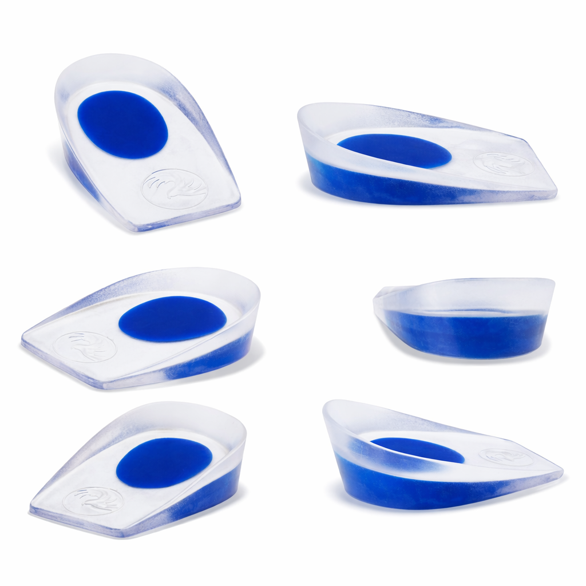
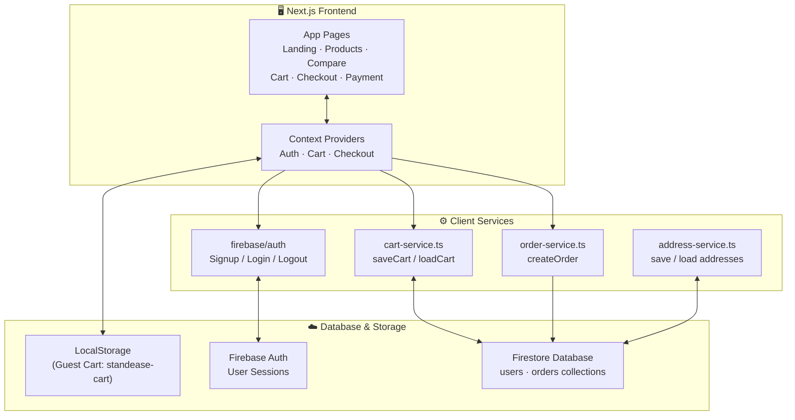
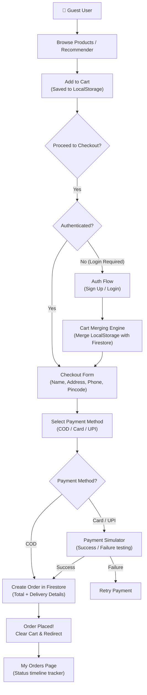
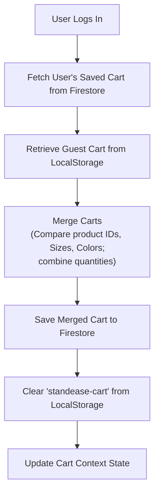

<div align="center">



<br/>

**StandEase** is a Next.js e-commerce application tailored for people who stand for long hours. Built on **Next.js 16 (App Router)**, **Tailwind CSS v4**, **Framer Motion**, and **Firebase (Auth & Firestore)** — it features interactive product comparison, an ergonomic standing-time recommendation engine, real-time guest-to-user cart merging, and a checkout pipeline with mock online payment simulations.

<br/>

[](https://nextjs.org)
[](https://react.dev)
[](https://tailwindcss.com)
[](https://firebase.google.com)
[](https://www.typescriptlang.org)


</div>

---

## Overview

Millions of professionals spend their entire workdays standing — homemakers in the kitchen, teachers, healthcare staff, retail workers, and developers at standing desks. However, traditional insoles and footwear support products are designed for active movements like walking or running, rather than static standing. 

Prolonged standing forces the heel to bear up to 80% of the body's weight, leading to concentrated heel pressure, lower-limb fatigue, and joint pain.

**StandEase takes a specialized approach.** Instead of athletic-focused insoles, StandEase distributes heel pressure evenly, works both barefoot (at home) and with shoes (at work), and stays lightweight. Users determine their ideal support level using an interactive standing-time recommender tool, add items to their cart (which syncs across sessions and merges automatically upon login), and place orders that can be tracked in real-time through an interactive shipping timeline.

**Engineering Philosophy:**
- **Zero Onboarding Friction** — Support for guest checkout, Firebase email/password registration, and Google OAuth to maximize conversion.
- **Stateless-to-Stateful Synchronization** — An intelligent guest cart stored in LocalStorage that automatically merges with the user's Firestore cart upon login, avoiding duplicate items and maintaining consistent state.
- **Component-First & Theme-Ready Styling** — Premium dark/light themes configured using `next-themes` and a custom component system leveraging Radix UI primitives.
- **Deterministic Order Timeline** — Real-time tracking pipeline from `placed` to `delivered` using Firestore document updates.

---

## Key Features

| Feature | Description | Status |
|---|---|---|
| **Ergonomic Recommender** | Interactive range slider that maps daily standing hours to optimal support levels | ✅ Live |
| **Interactive Comparison** | Direct side-by-side product matrix comparing compatibility, duration, and cushioning | ✅ Live |
| **Real-time Cart Merging** | Seamless local storage guest cart migration to Firestore collection on user login | ✅ Live |
| **Step-by-step Checkout** | Form-validation-enabled checkout flow capturing delivery details and payment choice | ✅ Live |
| **Payment Simulator** | Mock payment gateway interface simulating Card/UPI success and failure results | ✅ Live |
| **Order Status Tracker** | Visual step-by-step timeline (`placed` → `processing` → `shipped` → `delivered`) | ✅ Live |
| **Firebase Auth & Firestore** | Cloud storage for users, carts, addresses, and order history | ✅ Live |
| **Dynamic Avatar Picker** | Custom profile personalization with database-persisted visual avatars | ✅ Live |
| **Adaptive Layout (Responsive)** | Tailwind-responsive navbar with burger menu and live cart count badges | ✅ Live |
| **Saved Addresses** | Address management dashboard in the customer account settings | ✅ Live |

---

## System Architecture

StandEase utilizes a Next.js App Router frontend communicating with Firebase client services. State management is handled through React context providers (`AuthContext`, `CartContext`, `CheckoutContext`) which orchestrate client-side local storage and remote Firestore databases.



---

## User Flow

From choosing an insole category to tracking an order:



---

## State Management: Cart Merging Engine

If a guest shopper adds products to their cart and subsequently signs in or registers, the local cart merges with the cloud database. Duplicate items with identical sizes and colors have their quantities combined, avoiding redundancies.



---

## Tech Stack

<div align="center">

<table>
  <tr>
    <td align="center" width="100">
      <br/>
      <sub><b>Next.js 16</b></sub>
    </td>
    <td align="center" width="100">
      <br/>
      <sub><b>React 19</b></sub>
    </td>
    <td align="center" width="100">
      <br/>
      <sub><b>TypeScript 5</b></sub>
    </td>
    <td align="center" width="100">
      <br/>
      <sub><b>Tailwind v4</b></sub>
    </td>
    <td align="center" width="100">
      <br/>
      <sub><b>Firebase v12</b></sub>
    </td>
    <td align="center" width="100">
      <br/>
      <sub><b>HTML5</b></sub>
    </td>
    <td align="center" width="100">
      <br/>
      <sub><b>CSS3</b></sub>
    </td>
    <td align="center" width="100">
      <br/>
      <sub><b>ESNext</b></sub>
    </td>
  </tr>
</table>

<br/>

<!-- Secondary tooling badges -->


</div>

---

## Getting Started

### Prerequisites

- **Node.js** 20.x or higher
- **npm** or **pnpm** installed locally
- A **Firebase Project** (Free Tier) with Authentication & Firestore database enabled

---

### 1. Set Up Firebase

1. Head to the [Firebase Console](https://console.firebase.google.com/) and click **Add Project**.
2. Go to **Authentication** -> **Sign-in Method** and enable **Email/Password**. You can optionally enable **Google** provider.
3. Go to **Firestore Database** and click **Create Database**.
4. Set Firestore rules to allow read/write access. For testing, you can use:
   ```javascript
   rules_version = '2';
   service cloud.firestore {
     match /databases/{database}/documents {
       match /users/{userId}/{document=**} {
         allow read, write: if request.auth != null && request.auth.uid == userId;
       }
       match /orders/{orderId} {
         allow read: if request.auth != null && resource.data.uid == request.auth.uid;
         allow write: if request.auth != null && request.resource.data.uid == request.auth.uid;
       }
     }
   }
   ```

---

### 2. Configure Environment Variables

Create a `.env.local` file at the root of the project by copying `.env.example`:

```bash
cp .env.example .env.local
```

Fill in the variables with your Firebase web configuration credentials:

```env
NEXT_PUBLIC_FIREBASE_API_KEY=your_firebase_api_key
NEXT_PUBLIC_FIREBASE_AUTH_DOMAIN=your_firebase_auth_domain
NEXT_PUBLIC_FIREBASE_PROJECT_ID=your_firebase_project_id
NEXT_PUBLIC_FIREBASE_STORAGE_BUCKET=your_firebase_storage_bucket
NEXT_PUBLIC_FIREBASE_MESSAGING_SENDER_ID=your_firebase_messaging_sender_id
NEXT_PUBLIC_FIREBASE_APP_ID=your_firebase_app_id
```

---

### 3. Install & Start Development Server

Run the following commands depending on your package manager:

#### Using pnpm:
```bash
pnpm install
pnpm dev
```

#### Using npm:
```bash
npm install
npm run dev
```

Open [http://localhost:3000](http://localhost:3000) in your browser to view the application.

---

## Database Schemas (Cloud Firestore)

StandEase stores and queries data in two main Firestore collections: `users` and `orders`.

### 1. `users` Collection
- **Document Path:** `/users/{uid}`
- **Properties:**
  ```json
  {
    "uid": "USER_AUTH_UID_STRING",
    "email": "user@email.com",
    "createdAt": "Timestamp",
    "avatar": "avatar-m1",
    "cart": {
      "items": [
        {
          "id": 1,
          "name": "StandEase Home Heel Band",
          "price": 499.99,
          "size": "8",
          "color": "blue",
          "quantity": 2,
          "image": "/images/homemaker.jpg"
        }
      ],
      "updatedAt": "Timestamp"
    }
  }
  ```
- **Subcollection Path:** `/users/{uid}/addresses/{addressId}`
  ```json
  {
    "fullName": "John Doe",
    "phone": "+1 234 567 890",
    "email": "john@example.com",
    "address": "123 Main St, Apt 4B",
    "city": "New York",
    "state": "NY",
    "pincode": "10001",
    "createdAt": "Timestamp"
  }
  ```

### 2. `orders` Collection
- **Document Path:** `/orders/{orderId}`
- **Properties:**
  ```json
  {
    "uid": "USER_AUTH_UID_STRING",
    "items": [
      {
        "id": 2,
        "name": "StandEase Office Insole",
        "price": 449.99,
        "quantity": 1,
        "size": "9",
        "color": "black",
        "image": "/images/office-insole-top.jpg"
      }
    ],
    "address": {
      "fullName": "John Doe",
      "phone": "+1 234 567 890",
      "email": "john@example.com",
      "address": "123 Main St, Apt 4B",
      "city": "New York",
      "state": "NY",
      "pincode": "10001"
    },
    "paymentMethod": "card",
    "status": "placed",
    "totalAmount": 449.99,
    "createdAt": "Timestamp"
  }
  ```

---

## Troubleshooting

<details>
<summary><strong>Firebase API Key or Initialization Failures</strong></summary>

Make sure your environment variables in `.env.local` are prefixed with `NEXT_PUBLIC_`. In Next.js, keys without `NEXT_PUBLIC_` are only accessible on the server side and will evaluate to `undefined` in client-side components, triggering initialization crashes.
</details>

<details>
<summary><strong>Orders Not Appearing in Dashboard</strong></summary>

Verify your Firestore security rules. If rules restrict access, checks like `raw.uid !== user.uid` in dynamic routes will push users back to the landing or orders index page. Open your browser console to verify if any "insufficient permissions" exceptions are raised.
</details>

<details>
<summary><strong>Cart Cleared Unintentionally on Refresh</strong></summary>

Verify that local storage behaves correctly in your browser. For guest users, the cart is cached under the key `standease-cart`. For logged-in users, the cart is synced to Firestore. Ensure you aren't running in an ultra-restricted private browsing mode that disables `localStorage`.
</details>

---

## Repository Structure

```
StandEase-Web/
│
├── app/                        # Next.js App Router Pages
│   ├── about/                  # About Us page detailing StandEase mission
│   ├── account/                # Profile & Avatar settings
│   │   └── addresses/          # Saved delivery addresses management
│   ├── cart/                   # Shopping cart page
│   ├── checkout/               # Checkout form (delivery + payment method)
│   ├── compare/                # Product comparison matrix
│   ├── contact/                # Customer contact form
│   ├── faq/                    # Frequently Asked Questions
│   ├── login/                  # Authentication page (Login / Sign Up)
│   ├── orders/                 # Order list page
│   │   └── [orderId]/          # Order details & tracking timeline
│   ├── payment/                # Mock Payment Gateway simulator
│   ├── products/               # Product catalog & filters
│   │   └── [id]/               # Product detail pages (size, color, buy now)
│   ├── returns/                # Return requests page
│   ├── test-auth/              # Auth utility test page
│   ├── globals.css             # Main styling configuration
│   ├── layout.tsx              # Base page HTML/Body wrapper
│   └── providers.tsx           # Context providers wrapper (Auth, Cart, Checkout, Themes)
│
├── components/                 # Shared React Components
│   ├── ui/                     # Radix & shadcn UI primitives (button, input, etc.)
│   ├── auth-guard.tsx          # Client-side routing protection
│   ├── filter-sidebar.tsx      # Sidebar filtering for product listings
│   ├── navbar.tsx              # Sticky navigation bar with authentication & cart indicators
│   ├── OrderSuccessOverlay.tsx # Visual feedback on successful order placements
│   ├── product-card.tsx        # Card display with animations for individual products
│   ├── ripple-background.tsx   # Premium background wave animation for landing page
│   ├── standing-time-recommender.tsx # Ergonomic insole recommendation engine
│   └── theme-provider.tsx      # Dark/Light theme configuration (next-themes)
│
├── hooks/                      # Custom React Hooks
│
├── lib/                        # Services and Global Context Providers
│   ├── types/                  # TypeScript interface definitions (e.g. Address)
│   ├── address-service.ts      # Address management backend queries (Firestore)
│   ├── auth-context.tsx        # Firebase Authentication context provider
│   ├── cart-context.tsx        # Shopping Cart logic and merge engine
│   ├── cart-service.ts         # Firestore cart sync queries
│   ├── checkout-context.tsx    # Checkout progress and address states context
│   ├── firebase.ts             # Firebase client SDK initialization (Auth, DB)
│   ├── order-service.ts        # Order database interactions (Firestore)
│   └── utils.ts                # Class name merge utilities (cn)
│
├── public/                     # Static assets
│   ├── avatars/                # User profile avatars
│   ├── images/                 # Insole product images and categories
│   └── icons...                # App favicon, svg assets
│
├── tsconfig.json               # TypeScript configurations
├── next.config.mjs             # Next.js configurations
├── package.json                # Project scripts and dependencies
├── tailwind.config.js          # Tailwind CSS configurations
└── README.md                   # Project documentation
```

---

## Contributing

Contributions are welcome. Before making changes:

1. Ensure the code compiles without TypeScript errors:
   ```bash
   npm run build # or pnpm build
   ```
2. Check for linting violations:
   ```bash
   npm run lint # or pnpm lint
   ```

---

<div align="center">

Built with Next.js · Firebase · Tailwind CSS · Framer Motion

</div>
